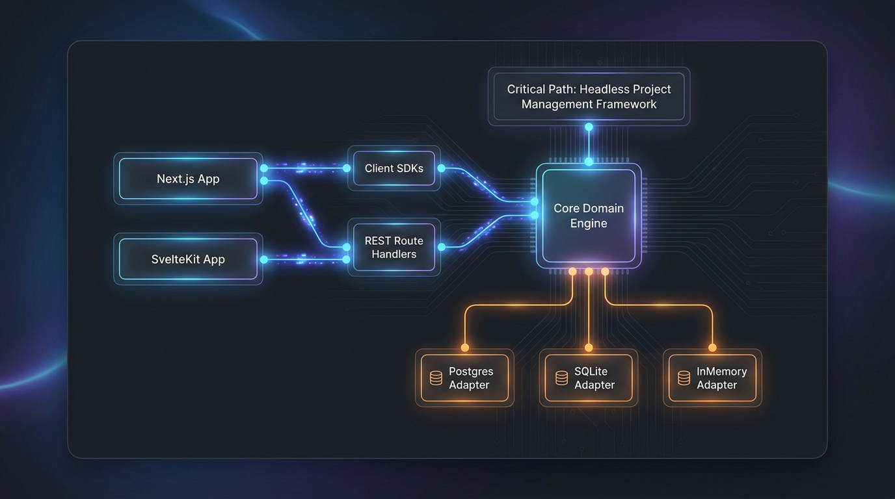

# 🚀 Critical Path

> **The Open-Source, Headless Project Management System Framework**  
> *Embed enterprise-grade project tracking, agile workflows, and task engines into any Web application in minutes.*

[](https://github.com/Pixerate/Critical-Path/actions/workflows/ci.yml)
[](https://opensource.org/licenses/MIT)
[](https://nodejs.org)
[](https://pnpm.io)

---

## 💡 What is Critical Path?

**Critical Path** is a modern, headless project management framework designed for modularity and effortless developer experience. Instead of forcing your organization into a rigid, monolithic PM web app, Critical Path provides a powerful, embeddable domain engine, database adapters, Web Fetch API compatible route handlers, and reactive UI client libraries.

Whether you're building a custom client portal, an internal software engineering dashboard, or an AI-driven project workspace in **Next.js** or **SvelteKit**, Critical Path handles task tracking, sprint management, custom schemas, role-based permissions, and activity feeds behind a clean, type-safe API.

---

## 🏗️ Architecture Overview



---

## ✨ Key Features

- 🎯 **Headless & Frontend-Agnostic**: Pure API-first architecture designed for Next.js (App Router), SvelteKit, Express, Fastify, and edge runtimes.
- 📋 **Comprehensive PM Work Items**: Full CRUD for Projects, Tasks, Sprints/Cycles, Task Dependencies, Subtasks, Priorities, and Estimates.
- 🔌 **Extensible Plugin Engine**: Lifecycle hooks (`beforeTaskCreate`, `afterTaskUpdate`, `beforeTaskDelete`), custom field type registries, and custom route middlewares.
- ⚙️ **Dynamic Custom Fields**: Attach structured custom fields (text, select, user, date, number, boolean) to projects and tasks on the fly.
- 🔔 **Webhooks & Audit Streams**: Real-time event notifications (`task.created`, `task.status_changed`) and immutable activity logs.
- ⏱️ **Time Tracking & Comments**: Threaded task discussions and built-in time entry logging.
- ⚡ **Type-Safe Ecosystem**: First-class TypeScript types across engine, server route adapters, client SDK, and React/Svelte hooks.

---

## 📋 MVP Feature Checklist

Below is the status of table-stakes features from [`docs/mvp.md`](./docs/mvp.md):

### Core Data & API Layer
- [x] **RESTful API**: Endpoints for projects, tasks, sprints, comments, and activities
- [ ] **GraphQL API**: *(Planned)*
- [x] **Webhook & Hook Support**: Async lifecycle hooks (`beforeTaskCreate`, `afterTaskUpdate`, etc.)
- [x] **Flexible Data Models**: Custom fields, custom statuses, and configurable priority levels
- [x] **Role-Based Access Control**: Project and task level RBAC role definitions

### Project & Task Management
- [x] **Work Item Tracking**: Task CRUD with priorities, due dates, estimates, and tags
- [x] **Multiple Views**: Interactive Kanban board (`useKanban`) and structured task list views
- [x] **Sprint & Cycle Management**: Sprint creation, task assignment, and cycle tracking
- [x] **Dependencies & Relationships**: Parent-child task hierarchies (`parentId`) and task linking

### Collaboration Features
- [x] **Comments & Discussions**: Threaded comments on tasks
- [x] **Activity Streams**: Immutable audit log feed of entity updates
- [ ] **File Attachments**: *(Planned)*
- [ ] **Wiki / Documentation**: *(Planned)*

### Time & Resource Management
- [x] **Time Tracking**: Logged hours, estimated hours, and `TimeEntry` models
- [ ] **Resource Allocation**: *(Planned)*
- [ ] **Budget Tracking**: *(Planned)*

### Reporting & Analytics
- [ ] **Built-in Reports**: Burndown charts and velocity metrics *(Planned)*
- [x] **Export Capabilities**: Structured JSON exports via REST API
- [ ] **Dashboard Widgets**: *(Planned)*

### Integration & Extensibility
- [ ] **Third-Party Integrations**: GitHub/GitLab native connectors *(Planned)*
- [x] **Plugin Architecture**: `PluginRegistry` with lifecycle hooks and route middlewares
- [ ] **Import/Export Tools**: Jira/Trello migration importers *(Planned)*

### Security & Compliance
- [x] **Authentication**: Route handler auth hooks and session propagation
- [x] **Data Encryption**: Full TLS/HTTPS support across API edge runtimes
- [x] **Audit Logging**: Structured mutation logging in `Activity` stream
- [x] **Vulnerability Policy**: Standard `SECURITY.md` reporting workflow

### Developer Experience & Headless Essentials
- [x] **Comprehensive Documentation**: Developer guide and package-level READMEs
- [x] **Sandbox Environments**: Built-in Next.js and SvelteKit interactive demo apps
- [x] **Multi-Channel & Frontend Agnostic**: Pure Web Fetch API compatible engine for any presentation layer

---

## 📦 Packages in this Repository

| Package | Description | Status |
| :--- | :--- | :--- |
| [`@critical-path/core`](./packages/core) | Core domain engine, plugin lifecycle hooks, and storage adapters |  |
| [`@critical-path/server`](./packages/server) | Web Fetch API router with adapters for Next.js App Router & SvelteKit |  |
| [`@critical-path/client`](./packages/client) | Type-safe HTTP Client SDK for web applications |  |
| [`@critical-path/react`](./packages/react) | React Context Provider and hooks (`useProjects`, `useTasks`, `useKanban`) |  |
| [`@critical-path/svelte`](./packages/svelte) | Svelte stores (`createProjectStore`, `createTaskStore`) |  |
| [`create-critical-path`](./packages/create-critical-path) | CLI tool (`npx create-critical-path@latest`) to scaffold new apps |  |

---

## 🚀 Quick Start

### Option A: Scaffold a New Project (30 Seconds)

```bash
npx create-critical-path@latest my-pm-app
```

### Option B: Mount into an Existing Next.js App

#### 1. Install Dependencies
```bash
npm install @critical-path/core @critical-path/server @critical-path/react @critical-path/client
```

#### 2. Create Route Handler (`app/api/critical-path/[...path]/route.ts`)
```ts
import { createNextHandler } from '@critical-path/server';

const handler = createNextHandler({
  initialData: {
    projects: [{ id: 'p1', key: 'PROJ', name: 'Main Product Roadmap' }]
  }
});

export { handler as GET, handler as POST, handler as PUT, handler as PATCH, handler as DELETE };
```

#### 3. Render Component with React Hooks (`app/page.tsx`)
```tsx
'use client';

import { CriticalPathProvider, useKanban } from '@critical-path/react';

function TaskBoard() {
  const { columns, moveTask } = useKanban('p1');

  return (
    <div className="flex gap-4">
      {Object.entries(columns).map(([status, tasks]) => (
        <div key={status} className="bg-gray-100 p-4 rounded-lg w-1/3">
          <h2 className="font-bold capitalize">{status} ({tasks.length})</h2>
          {tasks.map((task) => (
            <div key={task.id} className="bg-white p-3 my-2 rounded shadow">
              <h3>{task.title}</h3>
            </div>
          ))}
        </div>
      ))}
    </div>
  );
}

export default function App() {
  return (
    <CriticalPathProvider options={{ baseUrl: '/api/critical-path' }}>
      <TaskBoard />
    </CriticalPathProvider>
  );
}
```

---

## ⚡ Extensibility & Plugin Example

Customize system behavior with plugin lifecycle hooks:

```ts
import { createNextHandler } from '@critical-path/server';
import type { CriticalPathPlugin } from '@critical-path/core';

// Custom plugin that automatically tags urgent tasks
const autoTagPlugin: CriticalPathPlugin = {
  id: 'auto-tagger',
  name: 'Auto Tag Urgent Tasks',
  version: '1.0.0',
  hooks: {
    beforeTaskCreate: (task) => {
      if (task.priority === 'urgent') {
        return { ...task, tags: [...(task.tags || []), 'CRITICAL-PATH-URGENT'] };
      }
      return task;
    },
    afterTaskUpdate: (task, previous) => {
      if (previous.status !== 'done' && task.status === 'done') {
        console.log(`🎉 Task "${task.title}" was completed!`);
      }
    }
  }
};

export const handler = createNextHandler({
  plugins: [autoTagPlugin]
});
```

---

## 🛠️ Local Development

Critical Path uses a [pnpm workspace](https://pnpm.io/workspaces) monorepo setup targeting **Node.js 24**:

```bash
# Clone repository
git clone https://github.com/Pixerate/Critical-Path.git
cd "Critical Path"

# Install workspace dependencies
pnpm install

# Build all packages
pnpm run build

# Run unit & integration test suite
pnpm run test
```

---

## 📄 License & Community

Critical Path is open-source software licensed under the [MIT License](./LICENSE).  
Developed with ❤️ by Jack James and the Open Source Community.
