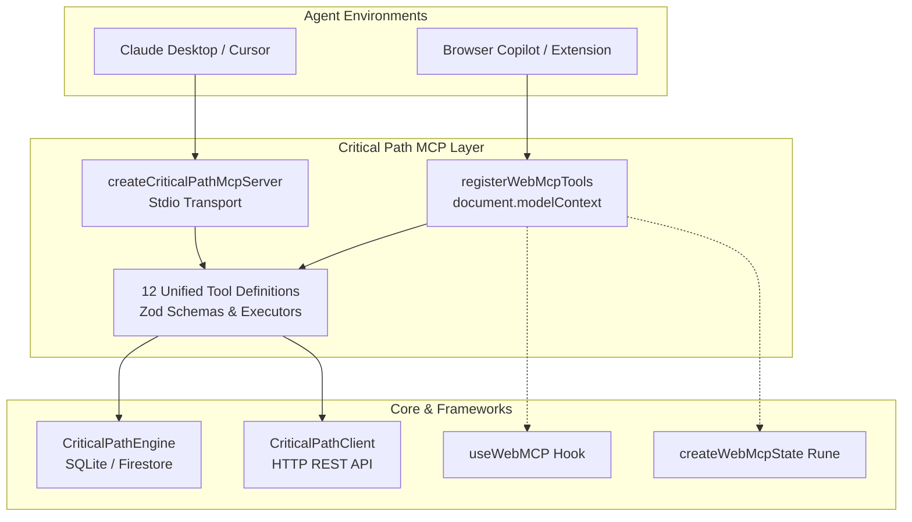

Critical Path provides native, first-class AI integration through the **Model Context Protocol (MCP)** via `@critical-path/mcp`.

Rather than treating AI as an external consumer that must screen-scrape UIs or guess REST endpoints, Critical Path exposes a **unified tool definition registry** that powers two distinct environments:

1. **Standard Server MCP** (`@critical-path/mcp/server`): Stdio or network transport connecting IDE agents (Claude Desktop, Cursor, Antigravity, cline) directly to local SQLite databases or remote Critical Path APIs.
2. **Client-Side WebMCP** (`@critical-path/mcp/web`): In-browser tool registration following the **W3C Web Machine Learning Community Group (WebML CG)** WebMCP specification, enabling browser copilots to interact with project state using ambient project scoping.

---

## 🏛️ Architecture



---

## 🛠️ Complete Tool Registry

`@critical-path/mcp` provides 12 strongly-typed tools covering project management, task tracking, deliverable rollups, and threaded conversations:

| Tool Name | Description | Key Arguments |
| :--- | :--- | :--- |
| `list_projects` | List all projects with optional query filter | `query`, `limit` |
| `get_project` | Get detailed project information by ID or slug | `id` |
| `create_project` | Create a new project workspace | `name`, `key`, `description` |
| `list_tasks` | List tasks filtered by project, status, priority, or assignee | `projectId`, `status`, `assigneeId` |
| `get_task` | Fetch full task details including dependencies | `id` |
| `create_task` | Create a new task within a project | `projectId`, `title`, `status`, `priority` |
| `update_task` | Update title, status, priority, description, or custom fields | `id`, `status`, `priority`, `title` |
| `delete_task` | Remove a task permanently | `id` |
| `list_deliverables` | List deliverables for a project with format and container specs | `projectId` |
| `create_deliverable`| Create a high-level creative deliverable | `projectId`, `title`, `format` |
| `list_comments` | Retrieve threaded discussion comments for a task | `taskId` |
| `add_comment` | Post a discussion comment or agent reply | `taskId`, `content`, `authorId` |

---

## 🎯 Ambient Project Scoping

When building frontend applications (e.g. viewing a project dashboard at `/projects/design-system`), user agents should not have to ask the user "Which project ID are you referring to?".

WebMCP supports **ambient scoping**:
```ts
registerWebMcpTools({
  client,
  projectId: 'proj_marketing_q3', // Ambient context
  tools: ['create_task', 'list_tasks']
});
```
When an LLM calls `create_task({ title: "Draft banner copy" })`, `projectId` is automatically resolved and injected without requiring the model to specify it.

---

## 📦 Installation

```bash
# Add to your project or monorepo
pnpm add @critical-path/mcp
```

- When using in server environments or Node CLIs, import from `@critical-path/mcp` or `@critical-path/mcp/server`.
- When bundling for the browser (Vite, Next.js client, SvelteKit), import from `@critical-path/mcp/web` to avoid bundling Node stdio transports.
