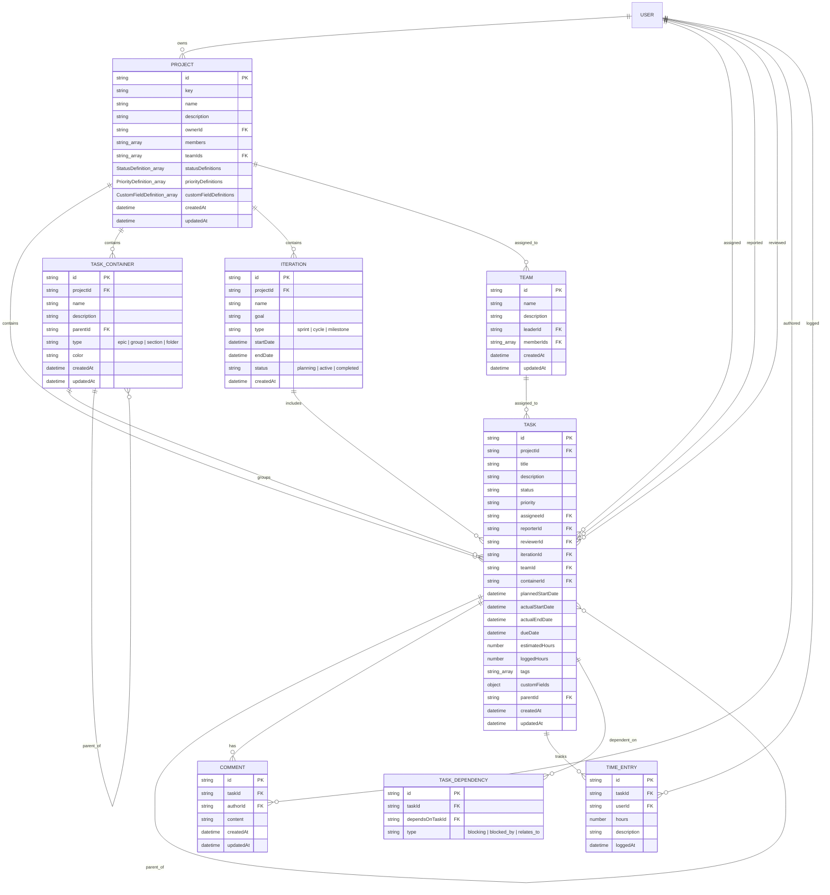

# Critical Path Data Model

`@critical-path` provides an agent-native, extensible project management schema and engine. This document outlines the core data entities, their relationships, and the foundational status framework.

## Entity Relationship Diagram

---

## Core Entities

### 1. Project
Projects represent top-level workspaces or repositories of work. Projects configure custom workflows via `statusDefinitions` and `priorityDefinitions`.

### 2. Team
Teams group users together (`memberIds`). A project can be associated with multiple teams (`teamIds`), and individual tasks can be assigned directly to a team (`teamId`).

### 3. Task Container (`TaskContainer`)
Containers provide structural hierarchy within a project (e.g., Epics, Groups, Sections, Folders). Containers can nest inside other containers via `parentId`.

### 4. Iteration
Generalizes time-boxed or milestone-based planning units (e.g., Sprints, Cycles, Release Milestones). Configured with `type`, `startDate`, `endDate`, and `status`.

### 5. Task
The central unit of work. Tasks support:
- **Date Tracking**: `plannedStartDate`, `actualStartDate`, `actualEndDate`, `dueDate`.
- **People & Roles**: `assigneeId`, `reporterId`, `reviewerId`.
- **Associations**: `projectId`, `teamId`, `containerId`, `iterationId`.
- **Subtasks**: `parentId` pointing to parent task.
- **Custom Config & Metadata**: `status` (string key), `priority` (string key), `tags`, `customFields`.

### 6. Foundational Status & Lifecycle Framework
While consumers define custom task statuses (arbitrary string keys e.g. `'ready_for_qa'`), Critical Path maps every status to foundational states:
- **`completionState`**: `'done' | 'not_done'` (Is the task completed or canceled?).
- **`executionState`**: `'active' | 'inactive'` (Is someone currently actively working on the task?).

The engine evaluates these foundational states alongside task dates to derive lifecycle indicators:
- `isDone`: `completionState === 'done'`
- `isActive`: `executionState === 'active'`
- `isOverdue`: `!isDone` and `dueDate < currentTimestamp`
- `isUpcoming`: `!isDone` and `!isActive` and `plannedStartDate > currentTimestamp`

---

## Dependency Graph

Tasks can establish relationships using `TaskDependency`:
- `blocking`: `taskId` cannot proceed until `dependsOnTaskId` is completed.
- `blocked_by`: Inverse of blocking.
- `relates_to`: Informational link.

Querying `engine.getTaskDependencyGraph(taskId)` returns:
- `upstreamTasks`: Tasks that `taskId` depends on.
- `downstreamTasks`: Tasks that depend on `taskId`.
- `dependencies`: Raw dependency records.
